# GNS Training on Frontera

This project focuses on training the **Graph Network Simulator (GNS)** on the **Frontera supercomputer** at TACC to model elastic-plastic interactions between solids and granular media.

---

## 🛠️ Environment Setup

Create and activate the virtual environment:

```bash
sh build_venv_frontera.sh
source start_venv.sh
```

---

## 📁 Dataset & Directory Structure

```bash
TMP_DIR="./data"
DATASET_NAME="mydata01"
DATA_PATH="${TMP_DIR}/${DATASET_NAME}/dataset/"
MODEL_PATH="${TMP_DIR}/${DATASET_NAME}/models/"
```

---

## 🧾 SLURM Batch Script (train.slurm)

```bash
#!/bin/bash
#SBATCH --job-name=gns_train
#SBATCH --output=gns_train.o%j
#SBATCH --error=gns_train.e%j
#SBATCH --partition=rtx     
#SBATCH --time=48:00:00   
#SBATCH --nodes=1
#SBATCH --ntasks=1
#SBATCH --mail-type=END            
#SBATCH --mail-user=seongeup@andrew.cmu.edu
#SBATCH -A BCS20003

# Activate environment
set -e
source start_venv_frontera.sh

# Define paths
DATASET="mydata01"
DATA_PATH="${SCRATCH}/gns_sparc/data/${DATASET}/dataset/"
JOB_ID=${SLURM_JOB_ID}
MODEL_PATH="${SCRATCH}/gns_sparc/data/${DATASET}/models_${JOB_ID}/"
OUTPUT_PATH="${SCRATCH}/gns_sparc/data/${DATASET}/rollouts_${JOB_ID}/"
mkdir -p "${MODEL_PATH}" "${OUTPUT_PATH}"

# Run Training
python -u -m gns.train \
  --data_path="${DATA_PATH}" \
  --model_path="${MODEL_PATH}" \
  --output_path="${OUTPUT_PATH}" \
  --nsave_steps=10000 \
  --ntraining_steps=5000000
```

---

## 📈 Training and Validation Loss

| Training Loss | Validation Loss |
|---------------|-----------------|
| 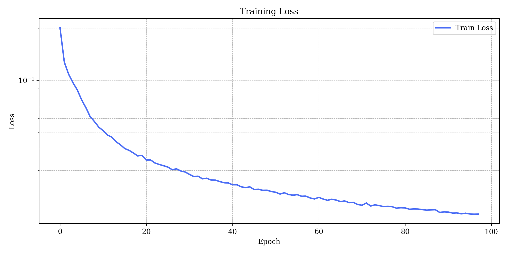 | 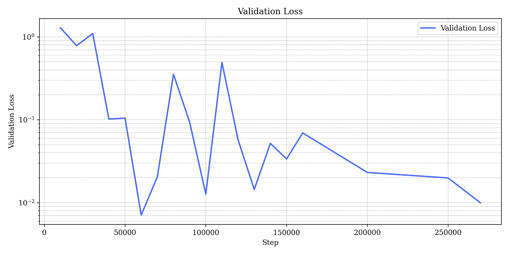 |

Both loss curves are plotted on a log scale. Training shows steady convergence while validation exhibits fluctuations typical of elastic-plastic system learning.

---

## 🧪 Sample Rollout Comparisons

Comparisons between GNS predictions and ground truth (MPM simulations) across multiple test samples:

<p align="center">
  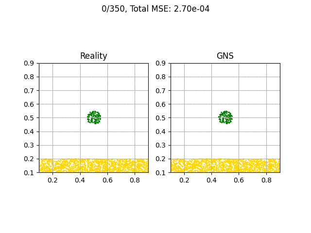
  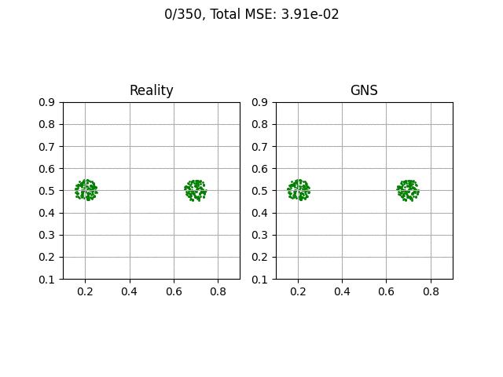
  <br/>
  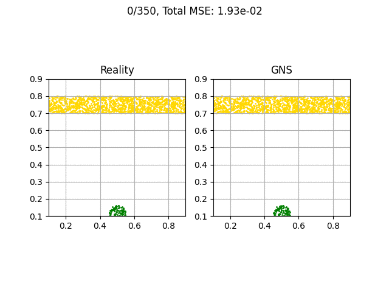
  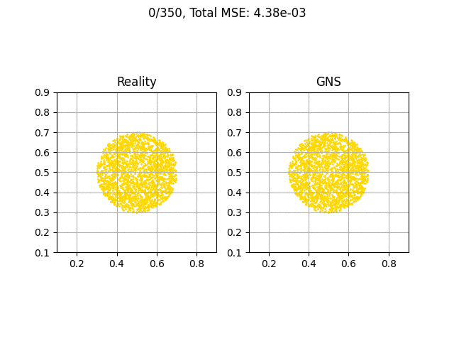
</p>

These comparisons confirm that the GNS model captures both particle positions and aggregate dynamics.

---

## 🔄 Learning Progress Example

Prediction quality improves as training progresses. Below, GNS predictions at different checkpoints are shown compared to the MPM ground truth.

<p align="center">
  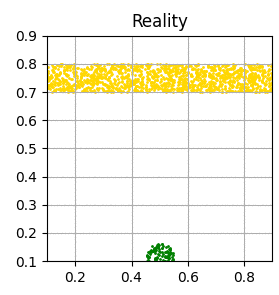
</p>

<p align="center">
  
  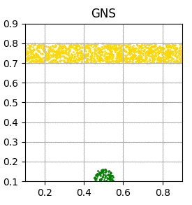
  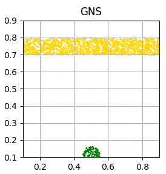
  <br/>
  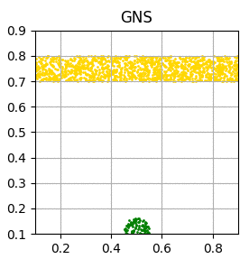
  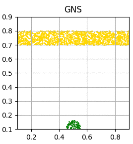
  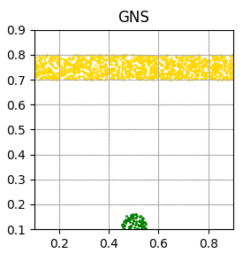
</p>


The model initially fails to capture structure but gradually learns to represent both the granular distribution and object boundary.

---

## 📦 Rollout Rendering (Optional)

After training:

1. Launch interactive GPU session:
    ```bash
    idev -p rtx -m 120
    ```

2. Activate your environment:
    ```bash
    source start_venv_frontera.sh
    ```

3. Set output path (example):
    ```bash
    OUTPUT_PATH="${SCRATCH}/gns_sparc/data/mydata01/rollouts_7243783/"
    ```

4. Run the renderer:
    ```bash
    python3 -m gns.render_rollout \
      --output_mode="gif" \
      --rollout_dir=${OUTPUT_PATH} \
      --rollout_name="rollout_ex0"
    ```

---

## 🔗 Reference

MPM ground truth data is generated using [Taichi-Elements](https://github.com/taichi-dev/taichi_elements).